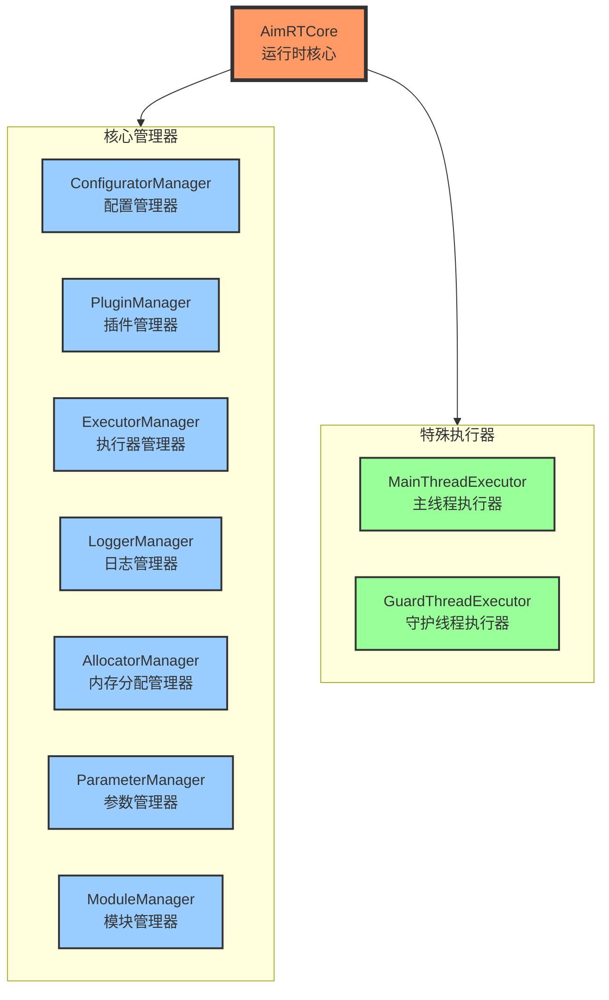
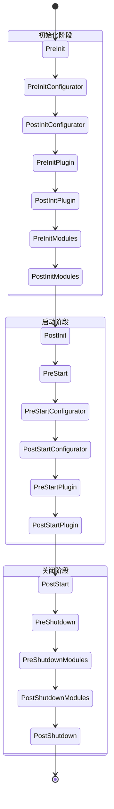

# AimRT Core Architecture

## 1. 核心组件结构

## 2. 状态转换流程

## 3. 核心功能特性

1. **生命周期管理**
- 完整的初始化-启动-关闭流程
- 支持同步和异步启动
- 状态转换钩子机制

2. **资源管理**
- 配置管理
- 插件系统
- 执行器调度
- 日志系统
- 内存分配
- 参数管理
- 模块管理

3. **线程管理**
- 主线程执行器
- 守护线程执行器
- 可扩展的执行器管理

4. **扩展性设计**
- 插件化架构
- 模块化管理
- 配置驱动
