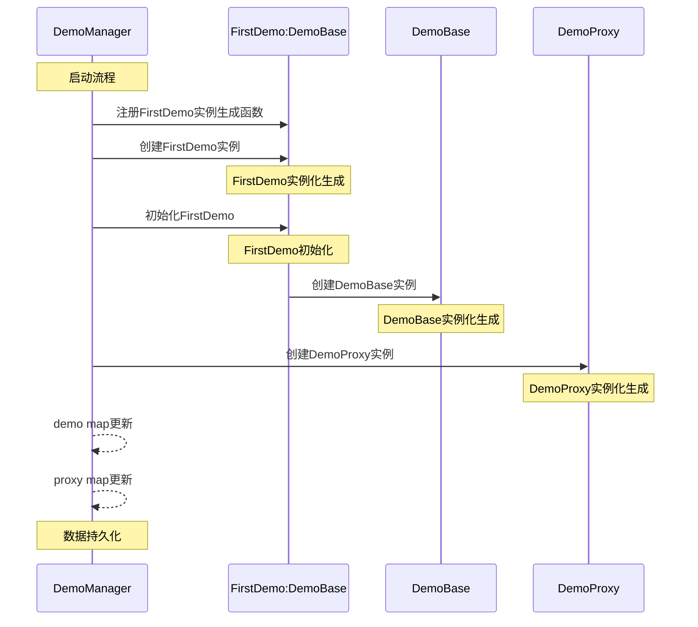
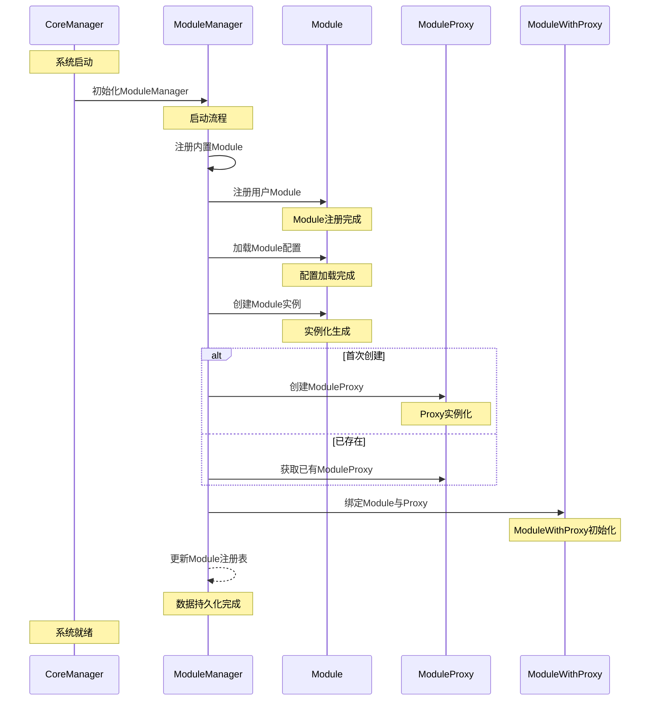

DemoManager的运行视图如下：

```mermaid
sequenceDiagram
    participant DM as DemoManager
    participant FD as FirstDemo:DemoBase
    participant DB as DemoBase
    participant DP as DemoProxy
    
    Note over DM: 启动流程
    
    DM->>FD: 注册FirstDemo实例生成函数
    DM->>FD: 创建FirstDemo实例
    
    Note over FD: FirstDemo实例化生成
    
    DM->>FD: 初始化FirstDemo
    
    Note over FD: FirstDemo初始化
    
    FD->>DB: 创建DemoBase实例
    
    Note over DB: DemoBase实例化生成
    
    DM->>DP: 创建DemoProxy实例
    
    Note over DP: DemoProxy实例化生成
    
    DM-->>DM: demo map更新
    DM-->>DM: proxy map更新
    
    Note over DM: 数据持久化
```
FirstDemo实例生成函数注册
FirstDemo实例化生成
FirstDemo初始化
DemoProxy实例化生成
存储入库

Module的运行视图如下：

```mermaid
sequenceDiagram
    participant Core as CoreManager
    participant MM as ModuleManager
    participant M as Module
    participant MP as ModuleProxy
    participant MWP as ModuleWithProxy
    
    Note over Core: 系统启动
    
    Core->>MM: 初始化ModuleManager
    
    Note over MM: 启动流程
    
    MM->>MM: 注册内置Module
    MM->>M: 注册用户Module
    Note over M: Module注册完成
    
    MM->>M: 加载Module配置
    Note over M: 配置加载完成
    
    MM->>M: 创建Module实例
    Note over M: 实例化生成
    
    alt 首次创建
        MM->>MP: 创建ModuleProxy
        Note over MP: Proxy实例化
    else 已存在
        MM->>MP: 获取已有ModuleProxy
    end
    
    MM->>MWP: 绑定Module与Proxy
    Note over MWP: ModuleWithProxy初始化
    
    MM-->>MM: 更新Module注册表
    Note over MM: 数据持久化完成
    
    Note over Core: 系统就绪
```
