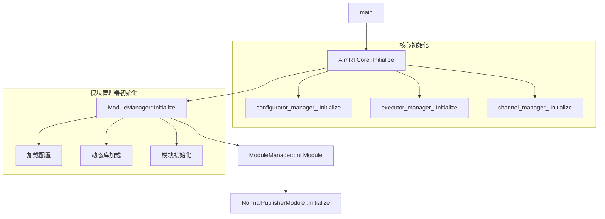

# AimRT框架模块初始化流程分析

本文详细分析了AimRT框架中模块初始化的完整流程，以`NormalPublisherModule`为例，展示了从`main`函数到具体模块初始化的全过程。

## 1. 初始化流程概览

### 1.1 调用链结构

整个初始化过程形成了一个完整的调用链：



### 1.2 核心组件关系


## 2. 详细初始化流程

### 2.1 main函数 - 系统入口

```cpp
int32_t main(int32_t argc, char** argv) {
    // 1. 命令行参数处理
    HandleCommandLineFlags(argc, argv);
    // 关键参数：
    // - cfg_file_path: 配置文件路径
    // - process_name: 进程名称
    // - register_signal: 是否注册信号处理
    
    // 2. 信号处理注册
    if (FLAGS_register_signal) {
        signal(SIGINT, SignalHandler);
        signal(SIGTERM, SignalHandler);
    }
    
    // 3. 核心对象创建和初始化
    AimRTCore core;                      // 创建核心对象
    global_core_ptr = &core;            // 设置全局指针（用于信号处理）
    
    AimRTCore::Options options;          // 创建选项
    options.cfg_file_path = FLAGS_cfg_file_path;  // 设置配置文件路径
    
    core.Initialize(options);            // 初始化核心
}
```

**关键点说明：**
- 通过命令行参数控制框架行为
- 注册信号处理器确保优雅退出
- 创建全局核心对象并初始化

### 2.2 AimRTCore初始化 - 框架核心

```cpp
void AimRTCore::Initialize(const Options& options) {
    // 1. 配置管理器初始化
    configurator_manager_.Initialize(options.cfg_file_path);
    // - 加载YAML配置文件
    // - 解析全局配置
    // - 设置各个模块的配置
    
    // 2. 执行器管理器初始化
    executor_manager_.Initialize();
    // - 创建线程池
    // - 设置调度策略
    
    // 3. 通道管理器初始化
    channel_manager_.Initialize();
    // - 创建消息通道
    // - 设置通信机制
    
    // 4. 模块管理器初始化
    module_manager_.Initialize();
    // - 加载动态库
    // - 注册模块
    // - 初始化各个模块
}
```

**初始化顺序设计：**
1. 先初始化配置管理器，确保后续组件可以读取配置
2. 再初始化执行器，为后续任务提供执行环境
3. 然后初始化通道，建立通信基础设施
4. 最后初始化模块，此时所有依赖都已就绪

### 2.3 ModuleManager初始化 - 模块管理核心

```cpp
void ModuleManager::Initialize(YAML::Node options_node) {
    // 1. 前置检查
    AIMRT_CHECK_ERROR_THROW(
        module_proxy_configurator_,
        "Module proxy configurator is not set before initialize.");
        
    // 2. 状态检查和切换
    AIMRT_CHECK_ERROR_THROW(
        std::atomic_exchange(&state_, State::kInit) == State::kPreInit,
        "Module manager can only be initialized once.");
        
    // 3. 加载配置
    if (options_node && !options_node.IsNull())
        options_ = options_node.as<Options>();
        
    // 4. 动态库加载
    for (auto& pkg_options : options_.pkgs_options) {
        auto module_loader_ptr = std::make_unique<ModuleLoader>();
        module_loader_ptr->SetLogger(logger_ptr_);
        // 加载动态库，并根据配置启用/禁用模块
        module_loader_ptr->LoadPkg(
            pkg_options.path, 
            pkg_options.disable_modules, 
            pkg_options.enable_modules);
    }
}
```

**关键设计点：**
- 使用状态机确保初始化顺序
- 支持动态加载和卸载模块
- 通过配置控制模块的启用/禁用
- 完整的错误检查和异常处理

### 2.4 ModuleManager::InitModule - 模块初始化桥梁

```cpp
void ModuleManager::InitModule(ModuleWrapper* module_wrapper_ptr) {
    // 1. 创建CoreProxy
    module_wrapper_ptr->core_proxy_ptr = std::make_unique<CoreProxy>();
    
    // 2. 初始化CoreProxy
    InitCoreProxy(module_wrapper_ptr->info, *module_wrapper_ptr->core_proxy_ptr);
    
    // 3. 调用模块初始化函数
    bool ret = module_wrapper_ptr->module_ptr->initialize(
        module_wrapper_ptr->module_ptr->impl,
        module_wrapper_ptr->core_proxy_ptr->GetBase());
        
    // 4. 检查初始化结果
    AIMRT_CHECK_ERROR_THROW(
        ret,
        "Initialize module '{}' failed",
        module_wrapper_ptr->info.name);
}
```

**核心传递机制：**
1. 创建`CoreProxy`实例
2. 根据模块信息配置代理
3. 通过接口传递给模块
4. 确保初始化成功

### 2.5 NormalPublisherModule初始化 - 具体模块实现

```cpp
bool NormalPublisherModule::Initialize(CoreRef core) {
    // 1. 核心引用保存
    core_ = core;
    
    // 2. 配置读取和解析
    auto file_path = core_.GetConfigurator().GetConfigFilePath();
    YAML::Node cfg_node = YAML::LoadFile(std::string(file_path));
    // 解析具体配置项
    topic_name_ = cfg_node["topic_name"].as<std::string>();
    channel_frq_ = cfg_node["channel_frq"].as<double>();
    
    // 3. 执行器获取和检查
    executor_ = core_.GetExecutorManager().GetExecutor("work_thread_pool");
    AIMRT_CHECK_ERROR_THROW(
        executor_ && executor_.SupportTimerSchedule(),
        "Get executor 'work_thread_pool' failed.");
        
    // 4. 发布者创建和类型注册
    publisher_ = core_.GetChannelHandle().GetPublisher(topic_name_);
    AIMRT_CHECK_ERROR_THROW(
        publisher_, 
        "Get publisher for topic '{}' failed.", 
        topic_name_);
        
    // 5. 注册消息类型
    bool ret = RegisterPublishType<ExampleEventMsg>(publisher_);
    AIMRT_CHECK_ERROR_THROW(
        ret, 
        "Register publish type failed.");
}
```

**模块初始化职责：**
1. 保存核心引用
2. 读取模块配置
3. 获取必要资源（执行器、通道等）
4. 注册消息类型
5. 进行完整性检查

## 3. 核心传递机制详解

### 3.1 设计理念

整个初始化过程中的核心传递机制就像一个精密的接力赛：

1. **起点（main函数）**
   - 创建`AimRTCore`对象
   - 设置全局指针
   - 准备初始化配置

2. **第一棒（AimRTCore）**
   - 完成基础设施初始化
   - 创建`CoreProxy`对象
   - 封装核心功能

3. **第二棒（ModuleManager）**
   - 加载模块动态库
   - 为每个模块创建代理
   - 传递核心接口

4. **终点（具体模块）**
   - 接收`CoreRef`接口
   - 通过接口访问核心功能
   - 完成自身初始化

### 3.2 安全机制

1. **接口隔离**
   - 模块只能看到`CoreRef`接口
   - 无法直接访问`AimRTCore`实现
   - 防止模块间相互干扰

2. **权限控制**
   - 通过`CoreProxy`控制访问权限
   - 可以为不同模块提供不同接口
   - 实现细粒度的权限管理

3. **资源管理**
   - 使用RAII确保资源正确释放
   - 统一的生命周期管理
   - 防止资源泄露

## 4. 最佳实践指南

### 4.1 模块开发规范

1. **初始化原则**
   - 只进行必要的初始化操作
   - 避免耗时的计算或IO操作
   - 确保初始化的原子性

2. **错误处理**
   - 使用`AIMRT_CHECK_ERROR_THROW`进行检查
   - 提供详细的错误信息
   - 保持异常安全

3. **配置管理**
   - 使用YAML文件管理配置
   - 支持运行时配置更新
   - 做好参数有效性验证

### 4.2 代码质量控制

1. **资源管理**
   - 使用智能指针管理内存
   - 采用RAII模式管理资源
   - 避免资源泄露

2. **线程安全**
   - 使用原子操作控制状态
   - 正确处理并发访问
   - 避免死锁风险

3. **扩展性设计**
   - 遵循开闭原则
   - 预留扩展接口
   - 保持向后兼容

## 5. 总结与展望

### 5.1 设计亮点

AimRT框架的模块初始化机制展现了优秀的工程实践：

1. **架构设计**
   - 清晰的层次结构
   - 良好的解耦合度
   - 灵活的扩展机制

2. **安全性**
   - 完善的错误处理
   - 严格的权限控制
   - 可靠的资源管理

3. **可维护性**
   - 统一的初始化流程
   - 标准的接口定义
   - 完整的配置管理

### 5.2 未来优化方向

1. **性能优化**
   - 支持并行初始化
   - 优化配置加载
   - 减少启动时间

2. **功能增强**
   - 支持热插拔
   - 增加健康检查
   - 提供更多调试工具

3. **开发体验**
   - 简化模块创建
   - 增强错误提示
   - 提供更多示例