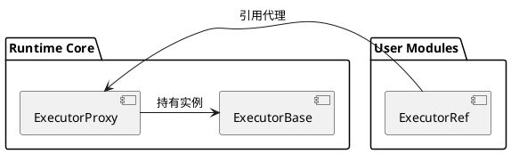

# Executor 代理与引用机制深度解析

## 核心设计差异

### 1. 生命周期管理
```cpp
// ExecutorProxy 创建（executor_manager.cc）
void ExecutorManager::CreateExecutor() {
    executor_proxy_map_[name] = 
        std::make_unique<ExecutorProxy>(executor_gen_func_(options));
}

// ExecutorRef 使用（user_module.cc）
void SubmitTask() {
    ExecutorRef ref = GetExecutor("async_worker");
    ref.Post([]{
        // 异步任务逻辑
    });
}
```

### 2. 接口层级对比
| 功能维度        | ExecutorProxy                          | ExecutorRef          |
|-----------------|----------------------------------------|----------------------|
| **C接口生成**   | 生成aimrt_executor_base_t              | 使用现有C接口        |
| **异常处理**    | 包含完整错误上下文捕获                | 依赖Proxy错误传递    |
| **性能开销**    | 高（含互斥锁/类型检查）               | 低（纯转发调用）     |

## 架构示意图解


## 最佳实践指南

### 1. 代理管理规范
```cpp
// 正确：通过Manager统一管理
class ExecutorManager {
    ExecutorProxyMap proxy_map_;  // 生命周期与Manager一致
};

// 错误：直接创建裸Proxy
void LeakProxy() {
    auto proxy = new ExecutorProxy(...);  // 易造成内存泄漏
}
```

### 2. 引用使用模式
```cpp
// 短期任务模式
void ProcessRequest() {
    {
        ExecutorRef ref = GetExecutor("db_pool");
        ref.Post([]{
            ExecuteSQL("SELECT...");
        });
    } // ref离开作用域自动释放
}

// 长期持有模式（需谨慎）
class Service {
    ExecutorRef ref_;  // 必须确保Manager存活
public:
    Service() : ref_(GetExecutor("io_pool")) {}
};
```

## 故障排查清单

✅ **引用失效问题**
- 现象：Segmentation fault when using ExecutorRef
- 检查项：
  1. 关联的ExecutorProxy是否已被销毁
  2. Manager实例是否提前释放

✅ **线程竞争问题**
- 现象：Data race in executor task queue
- 解决方案：
  ```cpp
  // 通过Proxy提交保证线程安全
  executor_proxy_map_["worker"]->Submit([]{
      // 临界区操作
  });
  ```